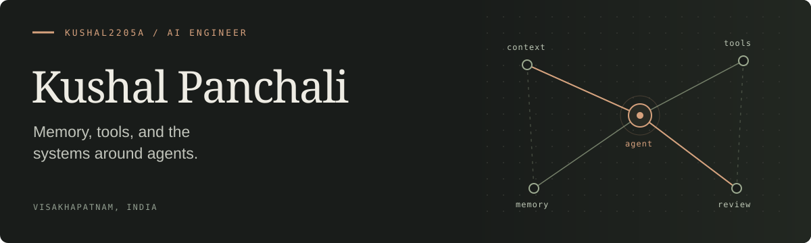

  

[Website](https://kushalpanchali.in) &nbsp; / &nbsp; [LinkedIn](https://www.linkedin.com/in/kushalpanchali) &nbsp; / &nbsp; [Email](mailto:kushalpanchali0522@gmail.com)

I build tools for AI agents and connected knowledge. My projects explore how agents keep context, when their workflows get stuck, and how to put a human decision before a destructive database query.

### Selected work

#### [mi∃a](https://github.com/Kushal2205a/miea-mem) · Memory agents can navigate

Graph memory stored in readable JSON files. Agents follow named relationships and retrieve context through MCP, with the interpretation left to the agent.

`Python` · `MCP` · `Graph traversal`

#### [Kliae](https://github.com/Kushal2205a/kliae) · A workspace for connected ideas

A native desktop app for building knowledge graphs. Open a node into its own nested graph; keep notes, images, and code alongside the connections.

`TypeScript` · `React` · `Tauri`

#### [Weir](https://github.com/Kushal2205a/database-security-layer-for-ai-agents) · A checkpoint before the query

A PostgreSQL proxy that intercepts destructive SQL and holds it for review in a web dashboard. Inspect the impact, then allow or block the query.

`Python` · `PostgreSQL` · `FastAPI`

#### [Workflow failure detection](https://github.com/Kushal2205a/multi-agent-workflow-failure-detection) · Catching agents going in circles

A live benchmark for coder–reviewer workflows. Detects repetition and stalled progress with lightweight heuristics, then compares turns and tokens against a baseline.

`Python` · `WebSockets` · `React`

---

More work: [AI-native HRMS](https://github.com/Kushal2205a/ai-native-hrms-portal) · [MRI classification study](https://github.com/Kushal2205a/brain-tumor-detection-hybrid-dl-ml)

Visakhapatnam, India · Open to work — <a href="mailto:kushalpanchali0522@gmail.com">get in touch</a>.
